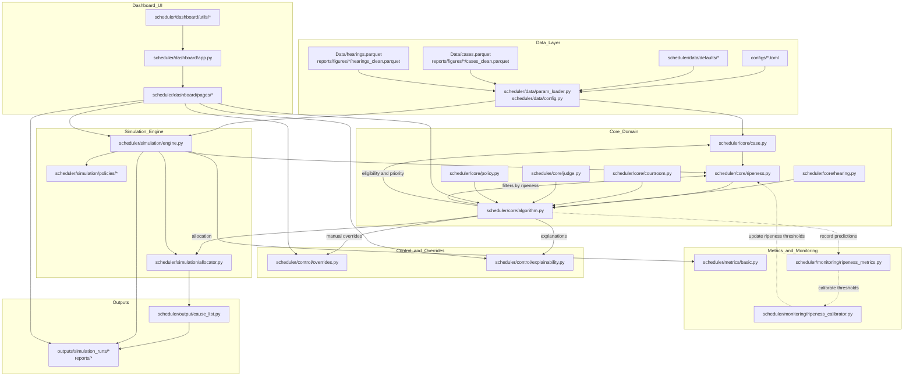

### Scheduler End-to-End Flowchart

This document shows the high-level flow across modules using Mermaid. It covers input data preparation, ripeness classification, scheduling, overrides, allocation, outputs, and optional simulation and dashboard flows.

#### Narrative
1) Data layer assembles parameters and input datasets via `param_loader.py` and `config.py`, pulling defaults from `scheduler/data/defaults/*` and optionally real case/hearing data.
2) Core domain models (`case.py`, `hearing.py`, `courtroom.py`, `judge.py`) define the state. Ripeness (`ripeness.py`) classifies cases as ripe/unripe and provides reasons and thresholds.
3) The scheduling algorithm (`algorithm.py`) orchestrates: ripeness filtering, priority computation, manual overrides, and courtroom allocation. Explanations are available through `control/explainability.py`.
4) Allocations produce cause lists (`output/cause_list.py`) and artifacts.
5) The simulation engine (`simulation/engine.py`) uses the same domain and policies to stress‑test scheduling strategies at scale, producing metrics and reports.
6) The dashboard (`scheduler/dashboard/*`) provides a UI to run data explorations, inspect ripeness, run simulations, and export cause lists.
7) Monitoring components track classification accuracy and enable future threshold calibration; currently not wired into the live flow.
